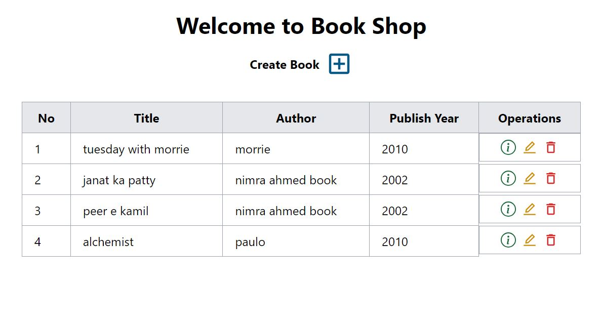
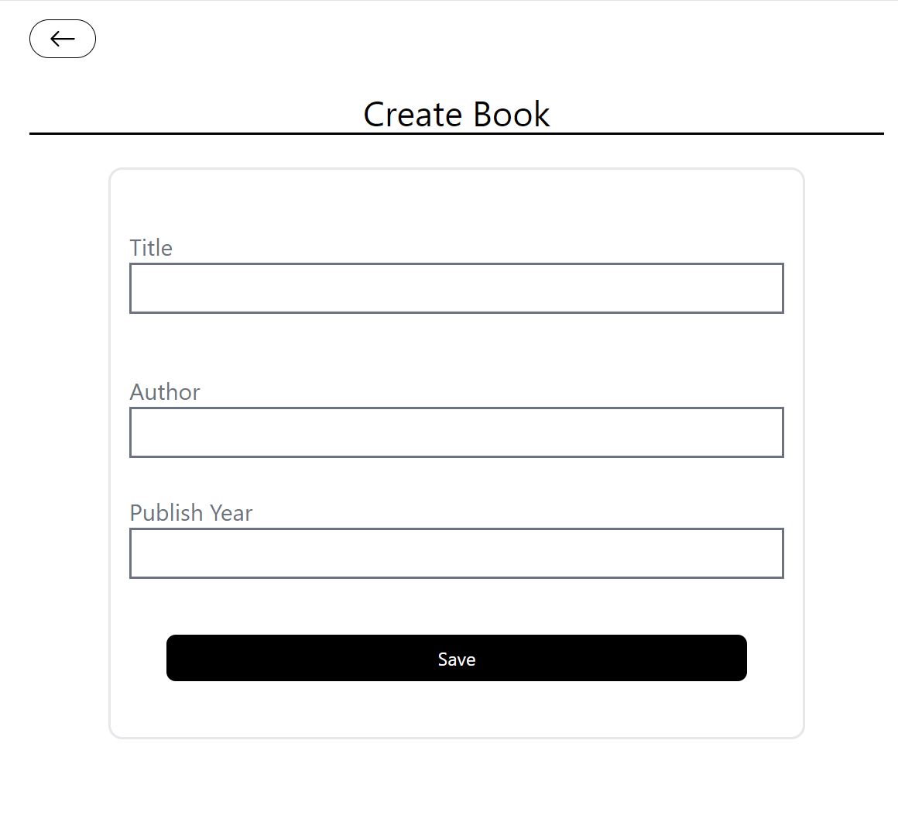
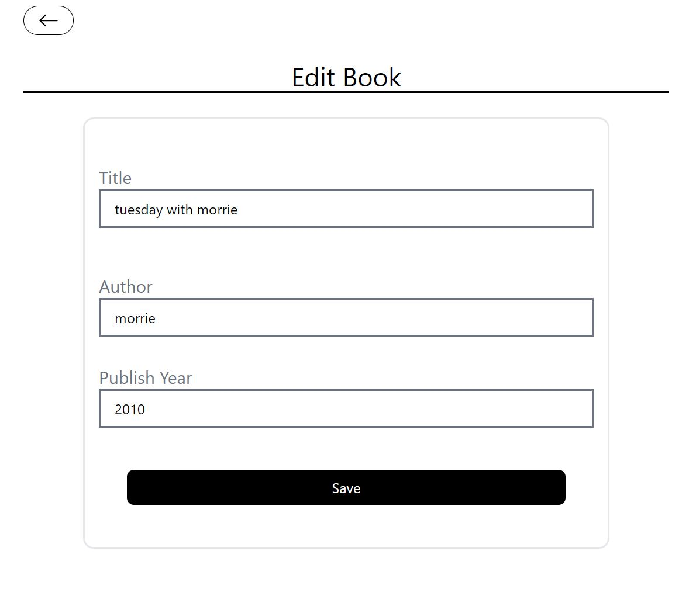
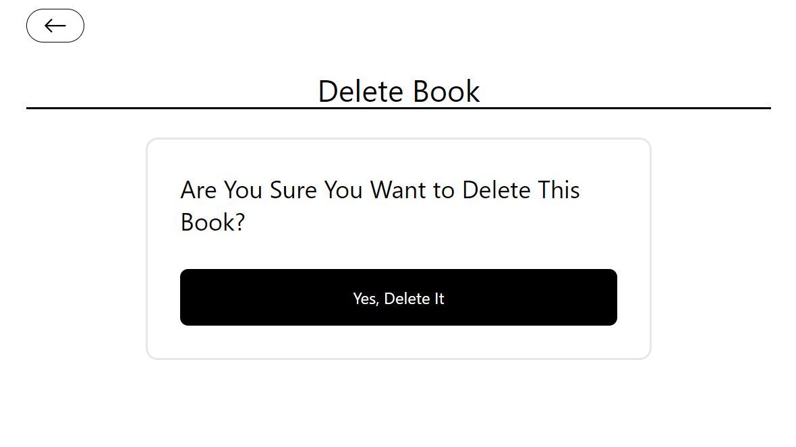

# Full-Stack Web Application - Book Shop: Node.js, Express.js, MongoDB, and React

## Overview

This project aims to develop a full-stack web application with CRUD (Create, Read, Update, Delete) functionality using Node.js, Express.js, MongoDB, and React. It focuses on building a robust backend API with CRUD operations and implementing a responsive frontend interface with routing capabilities.

## Backend

### CRUD Operations
- Implement CRUD operations for managing data in the MongoDB database.
  - CreateBook: Add new entries to the database.
  - Read: Retrieve data from the database.
  - UpdateBook: Modify existing entries in the database.
  - DeleteBook: Remove entries from the database.

### Router
- Configure backend routes for handling various HTTP requests.
  - Define routes for CRUD operations to interact with the database.
  - Organize routes using Express Router for better code structure and maintainability.

### CORS Policy

### MongoDB Operations

## Frontend

### CRUD Operations
- Develop frontend components and functionalities for performing CRUD operations.
  - Create: Implement forms for adding new data entries.
  - Read: Display data retrieved from the backend in an organized manner.
  - Update: Provide forms or interactive elements for editing existing data.
  - Delete: Offer options for removing data entries.

  ## Frontend Screenshots

### Home Page

### Create Book

### Edit Book

### Delete Book

### Show Book

### Router
- Configure client-side routing using React Router DOM for navigation between different views or pages.
  - Define routes for different components or pages within the React application.
  - Implement navigation links and route parameters for dynamic content rendering.

## License

This project is licensed under the [MIT License](LICENSE).

---
